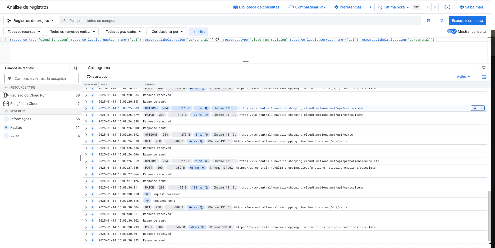

# Navalia Shopping

Navalia Shopping is a promotional shopping cart system designed to calculate the best possible total price for a set of products based on promotional offers (e.g., “Get 3 for the price of 2” and a 15% VIP discount). The project follows Clean Architecture and Domain-Driven Design (DDD) principles to ensure maintainability, scalability, and testability.

View the live project at: [Navalia Shopping](https://navalia-shopping.web.app/).

--------------------------------------------------------------------------------
## Quickstart

Below is a brief guide to quickly set up the local environments for both the backend and frontend. For more detailed instructions, please refer to the respective sections in this README.

### Backend Quickstart

1. Clone the repository:
   ```bash
   git clone https://github.com/vitorcesar25/navalia-shopping.git
   ```
2. Navigate to the services directory:
   ```bash
   cd navalia-shopping/services
   ```
3. Install the required dependencies:
   ```bash
   npm install
   ```
4. Navigate back to the main repository:
   ```bash
   cd ..
   ```
5. Install Firebase Tools if not already installed:
   ```bash
   npm install -g firebase-tools
   ```
6. Start the Firebase emulators (from the /navalia-shopping directory):
   ```bash
   firebase emulators:start
   ```

### Frontend Quickstart

1. Navigate to the frontend folder:
   ```bash
   cd navalia-shopping/frontend
   ```
2. Install frontend dependencies:
   ```bash
   npm install
   ```
3. Run the development server:
   ```bash
   npm run dev
   ```
4. Open your browser at http://localhost:3000 to view the application.

--------------------------------------------------------------------------------
## Table of Contents

1. [Introduction](#introduction)  
2. [Project Structure](#project-structure)  
3. [Backend](#backend)  
   3.1 [Architecture](#architecture)  
       - [Design and Evolution](#design-and-evolution)  
       - [Layered Domain Structure](#layered-domain-structure)  
   3.2 [Local Environment Setup](#local-environment-setup-backend)  
       - [Configuration](#configuration-backend)  
       - [Backend Execution](#backend-execution)  
       - [Running Tests](#running-tests-backend)  
   3.3 [Persistence and Firebase Integration](#persistence-and-firebase-integration)  
       - [Firestore Emulator (Local)](#firestore-emulator-local)  
       - [Firestore Database (Production)](#firestore-database-production)  
   3.4 [Scalability and Monitoring](#scalability-and-monitoring-backend)  
   3.5 [Future Enhancements](#future-enhancements)  
4. [Frontend](#frontend)  
   4.1 [Overview](#frontend-overview)  
   4.2 [Local Environment Setup](#local-environment-setup-frontend)  
       - [Frontend Execution](#frontend-execution)  
       - [Running Tests](#running-tests-frontend)  
   4.3 [Frontend Design](#frontend-design)  
       - [Firebase Hosting](#firebase-hosting)  
   4.4 [Scalability and Monitoring](#scalability-and-monitoring-frontend)  
5. [User Authentication](#user-authentication)  
6. [Testing Strategy](#testing-strategy)  
   - [Unit and Integration Tests](#unit-and-integration-tests)  
   - [End-to-End Testing](#end-to-end-testing)  
7. [GitHub Workflows & Deployment](#github-workflows--deployment)  
8. [Concurrency Management in Cart Updates (Future)](#concurrency-management-in-cart-updates-future)  
9. [References](#references)

--------------------------------------------------------------------------------
## Introduction

Navalia Shopping was created to demonstrate best practices in structuring, organizing, and implementing a promotional shopping cart system. Key features include:

- Get 3 items for the price of 2.  
- Optional VIP discount (15%).

Its Clean Architecture approach decouples core business logic from infrastructure and external services, promoting faster development, easier maintenance, and robust test coverage.

--------------------------------------------------------------------------------
## Project Structure

Below is the high-level directory layout:

```
navalia-shopping  
│  
├── services/  
│   ├── cart/                 # Cart domain.  
│   │   ├── src/                  # Source code for cart module.  
│   │   │   ├── application/      # Business rules and Domain orchestration.
│   │   │   ├── domain/           # Core business entities.
│   │   │   ├── infrastructure/   # Deals with external systems (Databases, APIs, etc).
│   │   │   ├── interfaces/       # Exposes the contracts of backend services and communication rules, routing, controllers, and middlewares.
│   ├── product/              # Product domain (follows the same folder structure as cart).
│   ├── promotion/            # Promotion domain (follows the same folder structure as cart).
│   ├── shared/               # Sharable modules.
│   └── index.js              # Entry point for firebase functions
│  
├── frontend/ 
│   ├── public/               # Public assets and HTML files  
│   ├── src/                  # Source code for the frontend application  
│   │   ├── components/       # Vue components  
│   │   └── styles/           # CSS or styling files
│   │   └── plugins/          # Plugins installed for frontend.
│   │   └── store/            # Vuex modules for domain orchestration (cart, product, promotion, and user).
│   └── main.js               # Entry point for the frontend application
│  
├── .github/workflows  
│   ├── firebase-functions-merge.yaml   # GitHub Action for Firebase Functions deployment.
│   ├── firebase-hosting-merge          # GitHub Action for Firebase Hosting deployment.
│   └── .prettierrc                     # Prettier configuration  
│  
├── requests/                 # .http requests files for HTTP Client Extension in VSCode to locally test endpoints.
├── .gitignore                # Git ignore file  
├── README.md                 # Project README  
└── firebase.json & .firebaserc   # Firebase configuration files for the project
```

### Project Strategy and Architecture Rationale

1. In designing this project, I chose to employ a monorepository structure to streamline development, address the time constraints of the assessment, and simplify repository management. This decision was guided by the premise that the application would initially function as an MVP (Minimum Viable Product), serving as the foundation for a soft launch with a limited user base, similar to the early stages of a startup. A monorepo allowed for rapid prototyping, enabling consistent boilerplate setup across services while maintaining a unified development environment for both backend and frontend components. This approach facilitated collaboration, reduced context-switching, and ensured a cohesive strategy for deploying Firebase-based services.

2. To align with this strategy, I modularized the codebase to support gradual scalability. Leveraging Firebase for core functionalities, including serverless backend functions, Firestore as the database, and hosting for the frontend, provided an efficient and resource-conscious infrastructure. This choice allowed for immediate monitoring of user activity, resource consumption, and system performance metrics post-launch. By adopting Firebase’s out-of-the-box capabilities, the MVP could be delivered quickly without sacrificing scalability, testability, or maintainability.

3. As the product grows and user adoption increases, this modularization ensures a clear path for scaling. The architecture was intentionally designed to enable teams to iterate and expand resource-intensive domains, segregating modules into standalone microservices or scaling individual Firebase functions based on usage patterns. This gradual evolution from a tightly coupled MVP to a more distributed and scalable infrastructure reflects a balanced approach: delivering a robust and efficient solution for the initial launch while maintaining the flexibility to adapt to the demands of a growing user base. This strategy meets the assessment’s requirements while prioritizing agility, cost-efficiency, and future-proofing.

--------------------------------------------------------------------------------
## Backend

### 3.1 Architecture

#### Design and Evolution

The backend follows Domain-Driven Design (DDD) concepts and Clean Architecture principles, which makes it:

- Modular: Each part of the system has clear boundaries.  
- Scalable: Easy to extend and add new features.  
- Testable: Business logic is isolated, facilitating comprehensive testing.

#### Layered Domain Structure

1. **Domain Layer**  
   - Core business entities, value objects, and domain rules.  
2. **Application Layer**  
   - Orchestrates use cases, enforces business rules, and coordinates domain activities.  
3. **Infrastructure Layer**  
   - Deals with external systems, including databases, APIs, and frameworks.  
4. **Presentation Layer**  
   - The Presentation Layer handles user interactions and communication with backend services. Built on Express.js, it manages routing with robust parameter validation to ensure data integrity. Middleware components handle logging, error management, and authentication seamlessly. Deployed using Firebase Hosting, this layer ensures scalability and a streamlined user experience.

--------------------------------------------------------------------------------
### 3.2 Local Environment Setup (Backend)

#### Configuration (Backend)

1. Clone the repository:
   ```bash
   git clone https://github.com/vitorcesar25/navalia-shopping.git
   ```
2. Navigate to the /services directory:
   ```bash
   cd navalia-shopping/services
   ```
3. Install the required dependencies:
   ```bash
   npm install
   ```
4. Navigate back to the main repository /navalia-shopping:
   ```bash
   cd navalia-shopping/
   ```
5. Install firebase tools if not installed on the folder:
   ```bash
   npm install -g firebase-tools
   ```

#### Backend Execution

From the /navalia-shopping directory, run:
```bash
firebase emulators:start
```
This command starts the server (Firebase Functions and Firestore emulators) on the configured ports, serving all backend endpoints, business logic, and the Firestore database persistence layer.

#### Running Tests (Backend)

In the /navalia-shopping/services directory, run:
```bash
npm test
```
This will execute all Jest unit and integration tests within the backend’s tests folder.

- Coverage results e tests strategy at: [Testing Strategy](#testing-strategy).

#### Deploying (Production)

You can run the following command from the root directory /navalia-shopping:
```bash
firebase deploy --only functions
```

--------------------------------------------------------------------------------
### 3.3 Persistence and Firebase Integration

#### Firestore Emulator (Local)

1. Install Firebase CLI (if you haven’t already):
   ```bash
   npm install -g firebase-tools
   ```
2. From the root directory or /navalia-shopping, start the Emulators:
   ```bash
   firebase emulators:start --only firestore
   ```
3. There is a seed function created to pre-populate the Firestore emulated database on the `index.js` entry point.

#### Firestore Database (Production)

1. Firestore is configured for Production and automatically set up for the production Firebase Functions.  
2. The `firebase.config.js` automatically configures the database access for the published Firebase project environment.

--------------------------------------------------------------------------------
### 3.4 Scalability and Monitoring (Backend)

- The decision to use Firebase Functions stems from their inherent scalability and seamless integration with other Firebase services. Firebase Functions enable vertical and horizontal scaling, automatically adjusting resources based on incoming traffic, ensuring that the application can handle sudden usage surges without manual intervention.

- Additionally, Firebase Functions offer a serverless architecture, reducing operational overhead by eliminating the need to manage and maintain server infrastructure. This approach ensures cost-efficiency, as you only pay for what you use, based on the number of invocations and compute time.

- For monitoring and debugging, Firebase Functions are integrated with Google Cloud Logging, providing real-time visibility into application performance and errors. The `/services/shared/utils/logger.js` file is used to streamline logging across the backend, making it easy to capture and trace logs within the Google Cloud Platform (GCP) dashboard. This setup enhances observability and simplifies incident resolution, ensuring a reliable and scalable backend infrastructure.




### 3.5 Future Enhancements

1. **Current Architecture with Firebase Functions**  
   - A primary Firebase Function was developed to streamline the development process, simplifying deployment and resource management.  
   - Domains can be split into separate Firebase Functions to improve scalability and allocate specific resources per function.  
   - Performance monitoring can guide decisions on which modules to separate or prioritize for resource allocation.

2. **Resource Optimization**  
   - Separate functions allow for independent scaling and resource management, avoiding the constraints of sharing a single container with 256MB.  
   - Shared interfaces, such as `services/cart/src/infrastructure/integrations`, enable seamless repository splitting or segregation of domain/application layers, possibly changing them to an API call.

3. **Caching Layer Implementation**  
   - To address repeated queries to Firestore, a caching layer can be implemented, storing frequently requested product data.  
   - Reducing redundant Firestore calls will enhance performance, lower query latency, and significantly reduce costs based on Firestore metrics.  
   - Solutions like Redis or in-memory caches within Firebase Functions can be employed effectively to achieve this goal.

4. **Database Segregation for Domains**  
   - Segregating the database into domain-specific structures allows better scaling and replication of resources.  
   - Each domain can have its own Firestore collections, improving read/write performance and enabling independent replication strategies.  
   - This approach aligns with scaling needs, ensuring better fault isolation and minimizing the performance impact on unrelated services.

5. **Limitations of Firebase Functions**  
   - Cold start latency can affect performance, especially for rarely used functions.  
   - Limited control over infrastructure and unpredictable costs may hinder scaling at larger levels.

6. **Future Migration to Kubernetes**  
   - Kubernetes offers enhanced resource control, containerization of domains, and support for a microservices architecture.  
   - Advanced orchestration features enable auto-scaling, load balancing, and cost optimization.  
   - The transition could provide better portability and long-term scalability while maintaining the flexibility of the domain-driven design.

7. **Monorepo Splitting for Team Consistency**  
   - Splitting the monorepo into dedicated repositories for each domain or service can improve team productivity and maintainability.  
   - Smaller, focused repositories reduce context-switching and simplify CI/CD pipelines.  
   - Teams can work on independent services without affecting others, ensuring faster development cycles and improved collaboration.  
   - This approach aligns with microservices and Kubernetes strategies, supporting future scalability and modularity.

These improvements align with the long-term vision of transitioning to a Kubernetes or microservices-based architecture, ensuring the platform remains scalable and cost-efficient as it grows.

--------------------------------------------------------------------------------
## Frontend

### 4.1 Overview

The frontend is built with Vue and Vuetify and communicates with the backend via REST using axios.

- Reusable Vue Components (located in `/components`).  
- State management for cart functionality, user authentication, promotion calculations, and product fetching.

--------------------------------------------------------------------------------
### 4.2 Local Environment Setup (Frontend)

#### Frontend Execution

1. Navigate to the `/frontend` directory:
   ```bash
   cd navalia-shopping/frontend
   ```
2. Install frontend dependencies:
   ```bash
   npm install
   ```
3. Start the development server:
   ```bash
   npm run dev
   ```
4. Open your browser at `http://localhost:3000`.

#### Running Tests (Frontend)

In the `/frontend` directory, run:
```bash
npx cypress open

or

npx cypress run --browser chrome
```

- These commands will execute the frontend-specific E2E tests with Cypress either on the UI or in the terminal, respectively.

- The tests will execute frontend and backend operations so both servers must be up and running:
   - [Backend Execution](#backend-execution)
   - [Frontend Execution](#frontend-execution)  

- Coverage results, scenarios and tests strategy at: [Testing Strategy](#testing-strategy).

--------------------------------------------------------------------------------
### 4.3 Frontend Design

The UI/UX focuses on providing a seamless shopping experience using the Material Design framework (Vuetify):

- **Reusable Components**: Encapsulated in the `/components` folder for modular development.  
- **Global State**: A store or context for cart items, user sessions, etc., and module segregation.

#### Firebase Hosting

To deploy the frontend:

1. Build the production version from `/navalia-shopping/frontend`:
   ```bash
   npm run build
   ```
2. Deploy to Firebase Hosting from the main directory `/navalia-shopping`:
   ```bash
   firebase deploy --only hosting
   ```
Your changes will be accessible via the Firebase Hosting URL (https://navalia-shopping.web.app).

--------------------------------------------------------------------------------
### 4.4 Scalability and Monitoring (Frontend)

- **Global CDN**: Firebase Hosting provides efficient, worldwide content delivery through its CDN-backed infrastructure, ensuring low latency and high availability for users regardless of their location.  
- **Error Tracking**: The system can integrate tools like Sentry or equivalents for advanced client-side error monitoring, offering real-time insights and improved debugging capabilities.

#### Pros

1. **Ease of Use**: Firebase Hosting simplifies deployment with seamless integration into CI/CD pipelines.  
2. **Scalability**: Automatically scales to handle sudden traffic spikes without manual intervention.  
3. **Secure Delivery**: HTTPS is enabled by default, with built-in security rules for controlling content access.  
4. **Cost-Effective for Small Projects**: Pricing scales with usage, making it economical for smaller applications or startups.

#### Cons

1. **Vendor Lock-In**: Reliance on Firebase Hosting may limit flexibility to switch to alternative hosting providers.  
2. **Custom Domain Configurations**: While supported, advanced domain configurations may require additional setup.  
3. **Limited Edge Customization**: Firebase Hosting provides limited flexibility for edge-based logic, such as server-side rendering or middleware processing.  
4. **Pricing at Scale**: Costs can grow unpredictably with high traffic, requiring close monitoring.

#### Future Enhancements

1. **Adopt Progressive Web App (PWA) Standards**: Enhance user experience by enabling offline capabilities, faster loading times, and push notifications.  
2. **Introduce Edge Computing for SSR**: Utilize solutions like Cloudflare Workers or Vercel Edge Functions for server-side rendering, dynamic routing, or A/B testing at the edge.  
3. **Integrate Real-Time Analytics**: Implement tools like Google Analytics 4 or a similar solution for deeper insights into user behavior and frontend performance.  
4. **Modular Deployment Strategies**: Consider splitting static assets and dynamic resources for separate deployment workflows, optimizing cache efficiency and reducing build times.  
5. **Cache Optimization**: Explore advanced caching techniques, such as stale-while-revalidate or pre-caching critical resources, to further enhance load times for returning visitors.

--------------------------------------------------------------------------------
## User Authentication

- **JWT Simulation**: The frontend currently uses hardcoded JWT tokens to simulate a VIP user and a regular user. These tokens are sent to the backend to simulate authentication flows.  
- **Backend Middleware**: A custom authentication middleware in the backend decrypts the token, identifies the user, authenticates the session, and propagates user metadata across domains. This ensures secure and consistent access control throughout the system.

### Future Improvements

1. **Firebase Authentication**: Transitioning to Firebase Authentication would streamline user session management by leveraging its built-in support for email/password logins, social authentication, and anonymous users. Firebase Authentication also provides secure ID tokens that can be validated server-side, ensuring robust security.
2. **Session Control**: With Firebase Authentication, session durations can be managed more effectively, enabling automatic session invalidation and refresh tokens for prolonged access. This reduces reliance on hardcoded JWTs and minimizes security risks.
3. **Centralized Token Propagation**: The backend can seamlessly use Firebase ID tokens to recognize logged-in users. These tokens can be verified server-side, allowing consistent propagation of user metadata across all backend domains.
4. **Role-Based Access Control (RBAC)**: Firebase Authentication integrates with Firebase Custom Claims, allowing roles such as VIP or regular users to be embedded into the token. This makes user permissions easily accessible and maintainable across the backend.
5. **Enhanced Monitoring and Security**: Firebase provides advanced monitoring tools to track login patterns, suspicious activities, and invalid access attempts. Additionally, integrating Firebase Authentication reduces the need to manage cryptographic token generation and verification manually.

By adopting Firebase Authentication, the authentication process would become more scalable, secure, and easier to maintain, aligning with best practices for modern application development.

--------------------------------------------------------------------------------
## Testing Strategy

### Unit Tests (Backend)

For the backend, Jest was used to create unit tests targeting the Application and Domain layers. These layers encapsulate the project’s core business logic and validation rules, making them critical for ensuring the correctness of the business flow.  

- **Unit Tests**: Validate individual functions, classes, or modules in isolation, you know more at [Running Tests](#running-tests-backend).

Below is an example of the current test coverage:

```
---------------------------------|---------|----------|---------|---------|-------------------
File                             | % Stmts | % Branch | % Funcs | % Lines | Uncovered Line #s 
---------------------------------|---------|----------|---------|---------|-------------------
All files                        |     100 |    94.44 |     100 |     100 |                   
 cart/src/application            |     100 |      100 |     100 |     100 |                   
  clearCart.usecase.js           |     100 |      100 |     100 |     100 |                   
  getCart.usecase.js             |     100 |      100 |     100 |     100 |                   
  updateCartItem.usecase.js      |     100 |      100 |     100 |     100 |                   
 cart/src/domain                 |     100 |      100 |     100 |     100 |                   
  Cart.js                        |     100 |      100 |     100 |     100 |                   
  CartItem.js                    |     100 |      100 |     100 |     100 |                   
 product/src/application         |     100 |       75 |     100 |     100 |                   
  getProducts.usecase.js         |     100 |       75 |     100 |     100 | 14-32             
 product/src/domain              |     100 |      100 |     100 |     100 |                   
  Product.js                     |     100 |      100 |     100 |     100 |                   
 promotion/src/application       |     100 |    83.33 |     100 |     100 |                   
  calculatePromotions.usecase.js |     100 |    83.33 |     100 |     100 | 55                
 promotion/src/domain            |     100 |    95.45 |     100 |     100 |                   
  BuyXPayYPromotion.js           |     100 |     90.9 |     100 |     100 | 41                
  PercentagePromotion.js         |     100 |      100 |     100 |     100 |                   
  Promotion.js                   |     100 |      100 |     100 |     100 |                   
---------------------------------|---------|----------|---------|---------|-------------------
Test Suites: 11 passed, 11 total
Tests:       79 passed, 79 total
Snapshots:   0 total
Time:        0.601 s, estimated 1 s
```

### End-to-End Testing (Frontend)

The frontend leverages Cypress for E2E tests, simulating real user workflows to validate complex operations such as applying promotions in the shopping cart. Cypress ensures seamless integration of frontend actions with backend responses, enabling thorough validation of the full application flow. Know more at [Running Tests](#running-tests-frontend).

- For the exercise the Sample Scenarios tests were implemented as follow results:


===========================================================================================

  (Run Starting)

  ┌────────────────────────────────────────────────────────────────────────────────────────────────┐
  │ Cypress:        13.17.0                                                                        │
  │ Browser:        Chrome 131 (headless)                                                          │
  │ Node Version:   v16.13.2 (/Users/vitorcesar/.nvm/versions/node/v16.13.2/bin/node)              │
  │ Specs:          2 found (commonUserPromotions.cy.js, vipUserPromotions.cy.js)                  │
  │ Searched:       cypress/e2e/**/*.cy.{js,jsx,ts,tsx}                                            │
  └────────────────────────────────────────────────────────────────────────────────────────────────┘


────────────────────────────────────────────────────────────────────────────────────────────────────
                                                                                                    
  Running:  commonUserPromotions.cy.js                                                      (1 of 2)


  Promotional Scenarios
    ✓ Common Customer, 3 T-shirts (16279ms)
    ✓ Common Customer, 2 T-shirts + 2 Jeans (17301ms)


  2 passing (34s)


  (Results)

  ┌────────────────────────────────────────────────────────────────────────────────────────────────┐
  │ Tests:        2                                                                                │
  │ Passing:      2                                                                                │
  │ Failing:      0                                                                                │
  │ Pending:      0                                                                                │
  │ Skipped:      0                                                                                │
  │ Screenshots:  0                                                                                │
  │ Video:        false                                                                            │
  │ Duration:     33 seconds                                                                       │
  │ Spec Ran:     commonUserPromotions.cy.js                                                       │
  └────────────────────────────────────────────────────────────────────────────────────────────────┘


────────────────────────────────────────────────────────────────────────────────────────────────────
                                                                                                    
  Running:  vipUserPromotions.cy.js                                                         (2 of 2)


  Promotional Scenarios
    ✓ VIP Customer, 3 Dresses (14377ms)
    ✓ VIP Customer, 2 Jeans + 2 Dresses (17187ms)
    ✓ VIP Customer, 4 T-shirts + 1 Jeans (19218ms)


  3 passing (51s)


  (Results)

  ┌────────────────────────────────────────────────────────────────────────────────────────────────┐
  │ Tests:        3                                                                                │
  │ Passing:      3                                                                                │
  │ Failing:      0                                                                                │
  │ Pending:      0                                                                                │
  │ Skipped:      0                                                                                │
  │ Screenshots:  0                                                                                │
  │ Video:        false                                                                            │
  │ Duration:     50 seconds                                                                       │
  │ Spec Ran:     vipUserPromotions.cy.js                                                          │
  └────────────────────────────────────────────────────────────────────────────────────────────────┘


====================================================================================================

  (Run Finished)


       Spec                                              Tests  Passing  Failing  Pending  Skipped  
  ┌────────────────────────────────────────────────────────────────────────────────────────────────┐
  │ ✔  commonUserPromotions.cy.js               00:33        2        2        -        -        - │
  ├────────────────────────────────────────────────────────────────────────────────────────────────┤
  │ ✔  vipUserPromotions.cy.js                  00:50        3        3        -        -        - │
  └────────────────────────────────────────────────────────────────────────────────────────────────┘
    ✔  All specs passed!                        01:24        5        5        -        -        -  


#### Scalability in Testing

To scale and improve the testing strategy, the following enhancements are recommended:

1. **Integration Testing**: Extend backend tests to include interactions with infrastructure components, such as Firestore, using emulators for realistic scenarios.  
2. **Mocking Backend Dependencies**: Use tools like MSW or JSON Server to mock backend services in E2E tests, isolating the frontend and ensuring the backend logic is correctly mirrored.  
3. **Integrate Cypress with GitHub Actions**: Run E2E tests automatically on pull requests, ensuring consistent quality checks before merging features.

By combining these methodologies, the testing framework supports both quality assurance and the system’s scalability, laying the foundation for reliable and maintainable development for the assessment validation.

--------------------------------------------------------------------------------
## GitHub Workflows & Deployment

Link for GitHub Actions: [Navalia Shopping Actions](https://github.com/vitorcesar25/navalia-shopping/actions).

- **Continuous Integration (CI)**: Automated pipelines (GitHub Actions) build and test the project on merge requests to the master branch.  
- **Continuous Deployment (CD)**: On successful merges to the master branch, automatic deployments to Firebase Hosting or Functions are triggered.

--------------------------------------------------------------------------------
## Concurrency Management in Cart Updates (Future)

Ensuring consistent and reliable cart updates in concurrent environments is critical, especially as the system scales. While this is not currently implemented in the project, the following strategies are identified as potential solutions to address concurrency issues in future iterations:

### Early Stage: Firestore Triggers with Firebase Functions

As a straightforward and reactive approach, Firestore Triggers integrated with Firebase Functions can handle cart updates. Each write operation to the Firestore cart collection could trigger a Cloud Function to process updates, maintaining consistency in the primary cart table.

- **Pros**: Simple to implement, leverages Firebase’s built-in serverless capabilities, and scales automatically with minimal setup.  
- **Cons**: In high-concurrency scenarios, multiple functions could be triggered for the same resource, potentially causing conflicts or inconsistencies.

### Advanced Stage: Queue-Based Orchestration with FIFO

For a more robust and scalable solution, a queue-based system (e.g., Apache Kafka, RabbitMQ, or Google Pub/Sub) could be used. In this approach:

- Updates are queued to ensure sequential processing using a FIFO strategy.  
- This guarantees that updates are handled one at a time, avoiding race conditions and ensuring consistency.

- **Pros**: Resolves concurrency issues, scales horizontally with increased load, and provides better observability of the update process.  
- **Cons**: Requires additional infrastructure, operational expertise, and higher initial setup effort.

### Future Consideration

These strategies are proposed as potential solutions for managing concurrency in cart updates. While not implemented in the current version of the project, they represent a vision for how the system could evolve to handle higher traffic and ensure reliable updates as the application grows.

--------------------------------------------------------------------------------
## References

- [Firebase Documentation](https://firebase.google.com/docs)  
- [Clean Architecture Principles](https://blog.cleancoder.com/uncle-bob/2012/08/13/the-clean-architecture.html)

--------------------------------------------------------------------------------